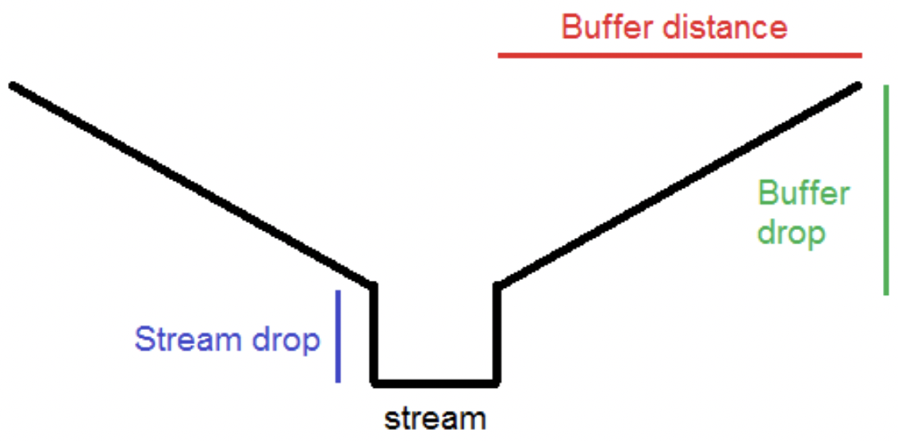

# Preprocessing tools guide

## Summary

The only preprocessing tool within LUCI is the *Generate* Baseline tool which must be run before any ecosystem services tools, and rerun to produce new land cover scenarios. The purpose of the preprocessing is two-fold:

- Generate the hydrological and topographical information by reconditioning the input DEM by filling depressions and using an approach based on the AGREE method to burn river networks into the elevation data.

- Generate the land management scenario using the soil and land cover provided by the user and comparing the classes to lookup tables that have the information required by LUCI's ecosystem services

## Input

- **Output folder for LUCI Baseline:** Specify the path and folder name where output from this tool should be stored.

- **Digital elevation model (DEM):** The DEM should be in GRID format and the recommended spatial resolution for use in LUCI is 5 to 10 m. The choice of resolution is very important. LUCI produces quantification and classification of ecosystem performance at the grid square scale i.e. for every grid square. If the DEM data is coarse, but vegetation, soil or other input data is of fine resolution, it is recommended that the DEM be resampled to a finer resolution. This is necessary to ensure the effect of, for example, small area vegetation or mangement interventions are accounted for. Resampling will not change topographical routing capabilities though and this will still be limited by the resolution of the original dataset.

- **Study area mask:** This shapefile sets the boundaries or extent for LUCI processing. All other inputs are clipped to the same extent.

- **Include uphill / upstream contributing area?:** Choose from the dropdown options below:

    - *No; calculate farm in isolation:* This option will only consider the farm area and will not consider any area uphill or upstream of the farm, even if it contributes overland, near-surface or stream run-off to the farm.

    - *Yes; include uphill contributing areas:* This option considers the farm plus a surrounding area. The surrounding area includes hillslopes which route overland and near-surface flow of water and diffuse pollution into the farm. **Note:** If using this option, the land use and soil shapefiles are recommended to have the same coverage of the DEM.

    - *Yes; include uphill areas plus upstream watersheds:* This option considers the farm plus a surrounding area. The surrounding area includes hillslopes which route overland and near-surface flow of water and diffuse pollutants into the study area, as well as watersheds draining streams that enter the farm. **Note:** If using this option, the land use and soil shapefiles are recommended to have the same coverage of the DEM.

- **Land cover dataset, land cover data source, and land cover linking code:** These three parameters relate to the input land cover dataset, which must be in polygon format. The land cover data source is specified in the table below. The land cover linking code is the main identifier field in the input land cover attribute table and is associated with the land cover classification of that data source. The land cover shapefile **must** have a field with the name of the *Land cover linking code* below and the correct classification. For example, if the user is using the product Land Cover Database 4 (LCDB4), the attribute table of the shapefile must contain the **CLASS_2012** field.

    This input data will feed through into many of the ecosystem service model outputs, so it is important to be aware of errors and uncertainties. These may be due to land use change occurring since the dataset was created, or mis-classification of land cover, due to the way in which remotely sensed data have been processed.

    To use another landcover data product, you would need to create a new column in your dataset that correlates to an equivalent value in one of the supported data products; all model output would then be subject to additional error in terms of the differences between real and assigned landcover, in terms of how the model has been parameterised for the supported landcover product.
    
    If you have detailed information about your landcover product to be used within LUCI, you may use user-defined landcover which requires a landcover shapefile and a land cover linking table. This linking table should contain the relevant fields and information to be used by LUCI. This will be used in the parameter *Land cover linking table* below.

    (Table 3: Land cover products supported by LUCI)
    | Land cover product | Land cover linking code | Provider |
    | --- | --- | --- |
    | Land Cover Map 2007 (LCM2007) | INTCODE | Centre for Ecology and Hydrology, United Kingdom |
    | Land Cover Map 2007 BH (LCM2007 BH) | FIELDCODE | Centre for Ecology and Hydrology, United Kingdom |
    | Terrestrial Phase 1 Habitat Survey (CCW Phase I) | CODE | Natural Resources Wales |
    | Land Cover Database 1 (LCDB1) | LCDBCLASS | Landcare, New Zealand |
    | Land Cover Database 2 (LCDB2) | LCDB2CLASS | Landcare, New Zealand |
    | Land Cover Database 3 (LCDB3) | LCDB3CLASS | Landcare, New Zealand |
    | Land Cover Database 4 (LCDB4) | CLASS_2012 | Landcare, New Zealand |
    | CORINE Land Cover (CORINE) | GRID_CODE | European Environment Agency |
    | National Land Cover Database 2011 (NLCD 2011) | VALUE | Multi-Resolution Land Characteristics, United States of America |

- **Soil dataset, soil data source, and soil linking code:** These three parameters relate to the input soil dataset, which must be in polygon format. The soil data source is specified in the table below. The soil linking code is the main identifier field in the input soil attribute table and is associated with the soil classification of that data source. The soil shapefile **must** have a field with the name of the *Soil linking code* below and the correct classification. For example, if the user is using the product Soilscapes, the attribute table of the shapefile must contain the **SS_ID** field.

    This input data will feed through into many of the ecosystem service model outputs, so it is important to be aware of errors and uncertainties. Soil mapping is often based on a limited number of samples, and the use of other datasets on geology and topography.

    To use another soil data product, you would need to create a new column in your dataset that correlates to an equivalent value in one of the supported data products; all model output would then be subject to additional error in terms of the differences between real and assigned soil, in terms of how the model has been parameterised for the supported soil product.

    If you have detailed information about your soil product to be used within LUCI, you may use user-defined soil which requires a soil shapefile and a soil linking table. This linking table should contain the relevant fields and information to be used by LUCI. This will be used in the parameter *Soil linking table* below.

    (Table 4: Soil products supported by LUCI)
    | Soil product | Soil linking code | Provider |
    | --- | --- | --- |
    | Soilscapes | SS_ID | Cranfield, United Kingdom |
    | NATMAP | MUSID | Cranfield, United Kingdom |
    | Fundamental Soils Layer (FSL) | SOIORDER | Landcare, New Zealand |
    | S-Map | smapSib1 | Landcare, New Zealand |

- **Gridded annual rainfall (mm):** This gridded raster should contain rainfall values in millimetres (mm) per year. Gridded rainfall is used in conjunction with evapotranspiration data to calculate effective rainfall for input to flow and diffuse pollution routing calculations. If this gridded raster layer is provided, accumulation of water, sediment and chemicals in the landscape will adjust to respect the overall spatial pattern in evapotranspiration, where appropriate. Lower resolution than DEM is permitted, since data are unlikely to be available at such fine resolution.

    For New Zealand, a 500m gridded data product is available for download with the tool and can be accessed by running the **Initialise LUCI** tool. This provides a good resolution to represent spatial pattern of rainfall, which will increase confidence in model output. This dataset will be used unless user input data on rainfall are provided (e.g. for climate scenarios). 

- **Annual rainfall value (mm):** Specify the annual rainfall amount received by the study area in millimetres (mm) per year.

- **Gridded annual evaporation (mm):** This gridded raster should contain evapotranspiration values in millimetres (mm) per year. Gridded evapotranspiration data is used in conjunction with rainfall data to calculate effective rainfall for input to flow and diffuse pollution routing calculations.

    For New Zealand, a 500m gridded data product is available for download with the tool and can be accessed by running the **Initialise LUCI** tool.

- **Annual evaporation value (mm):** Specify the annual evaporation value of the study area in millimeters (mm) per year.

- **Stream network option and Stream network:** These parameter influences where LUCI places streams in the study area. Choose from the dropdown options for *Stream network option:*

    - *Generate river network directly from DEM:* This option uses the DEM topography to determine where streams should be burned.

    - *Burn in user-defined stream:* This option allows users to define their own stream network. The stream network must be a polyline shapefile. The path to and file name of the stream network must be specified in the Stream network parameter

- **Accumulation threshold for stream initiation, major rivers, and ephemeral streams:** These three parameters influence where LUCI models streams based on the flow accumulation of that cell. Default values are provided for generally temperate environments and hilly topography. For areas with flatter topography, it is recommended to raise the default values by a factor of 5 to 10. It is recommended to iterate through and test which values would produce a stream network closer to reality.

- **Point water additions/subtractions:** This input should contain a point shapefile of locations associated with additions (e.g. springs) or subtractions (e.g. irrigation takes) of water to or from the stream network.

    The data must include an attribute table column, headed 'CUMECS', giving an annual average addition or subtraction in m^3^/s. Values must be positive for additions and negative for subtractions.
    
    Including this data will increase accuracy of annual average flow calculations. If the data are not available, possible additions or subtractions should be considered when using stream flow output generated by the model.

- **Force water additions/subtractions to stream network?:** This option should be marked true unless there are known additions or subtractions which are not directly connected to the stream network.

- **Stream smooth drop buffer distance (m), stream smooth drop (m), and stream drop (m):** These three parameters influence the stream reconditioning as seen below:

    (Figure 2: Diagram of the stream reconditioning parameters at the stream cross-section)
    

- **Minimum lake area threshold (ha):** Specify the minimum area threshold in hectares (ha) for a water body to be considered a lake and for output from that water body to be generated.

- **Determine stream entry and exit points and watersheds:** Check this option to create the point shapefile of entry/exit points and the polygon shapefile of the watersheds.

- **Elevation modifications:** This input should contain a polygon or polyline shapefile of locations where elevation is different to that shown in the DEM. For example, where elevated flood stopbanks are located.
    
    The data must include an attribute table column, headed 'metres_chg', giving the elevation of the feature in metres. Be wary of putting in small or narrow modifications as LUCI will modify whole DEM grid squares that intersect with each polyline or polygon.

- **Are elevation modifications relative (box ticked) or absolute (box unticked)?:** If this option is ticked/true, input modifications to the elevation are added (for a decrease in height, put a negative number). If it is not ticked/false, the input elevation modifications will be assumed to be absolute, and relative to sea level.

- **Detailed or corrected land cover:** This input should be a polygon with changes to land cover. See the subsection *Exploring different scenarios* above for more information about how to construct this polygon shapefile.

- **Land cover linking table:** For applications that use a land cover classification not already supported within LUCI, the land cover linking table must contain the unique identifier field of the land cover (e.g. FIELDCODE) and fields that are used within LUCI. To use this, be sure to select *User-defined* in the parameter *Land cover data source* above and to fill in the identifier field in *Land cover linking code*. This option is for users who know the fields used by the LUCI algorithms and are familiar with their classification.

- **Detailed or corrected soil data:** Similar to corrected land cover, this input allows corrections to be made to the default or national soil dataset if more specific information is available.

- **Soil linking table:** For applications that use a land cover classification not already supported within LUCI, the land cover linking table must contain the unique identifier field of the land cover (e.g. FIELDCODE) and fields that are used within LUCI. To use this, be sure to select *User-defined* in the parameter *Soil data source* above and to fill in the identifier field in Soil linking code. This option is for users who know the fields used by the LUCI algorithms and are familiar with their classification.

- **Soil data disaggregation:** Specify the integer code to indicate if England and Wales carbon model will be run, and if so what level of disaggregation to apply. If modelling outside England and Wales, or not planning to model carbon, this should be set to 0.
    
    For England and/or Wales, if planning to run for fully disaggregated England and Wales carbon, this should be set to 15. An updated or scenario land cover layer can then be supplied if desired, or the model can be applied to calculate potential for sequestration under maximum soil carbon storage scenario.
    
    The model can also be run according to values applied by the UK carbon LULUCF inventory level. To do this, soil disaggregation should be set to 14. This method uses the UK LULUCF inventory values to estimate carbon for land cover change, hence it will be necessary to also supply an updated or scenario land cover layer so that the model can apply inventory values for landcover change.

- **Soil sibling handling option:** This is specific for applications using the Smap dataset in New Zealand. Smap links a number of soil types or 'siblings' to each soil polygon. This option identifies which soil sibling or combination of siblings to consider.

    - *Use dominant soil sibling:* This option considers only the main or dominant soil sibling.

    - *Use weighted average of soil siblings:* This option considers all soil siblings, weighted according to their prevalence within each polygon.

    - *Choose random soil sibling according to probability of coverage:* This option considers one soil sibling, which is chosen according to the probability of coverage.
    
- **New land cover or Scenario:** This polygon shapefile is a required input if you plan to run the England and Wales carbon model for the LULUCF level of soil aggregation (code 14). It is an optional input for the fully disaggregated carbon model (code 15). This layer must have the same "land cover linking code", i.e. main identifier code, as the input land cover.

## Output

None of the files produced by this tool are considered to be fundamental LUCI output, rather they are intermediate files for use by the single services functions described later. The output folder contains a variety of rasters and shapefiles used by LUCI to generate various single services calculation.