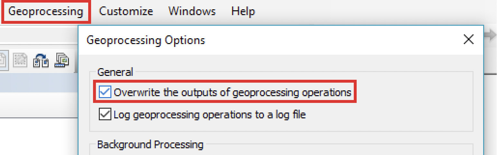
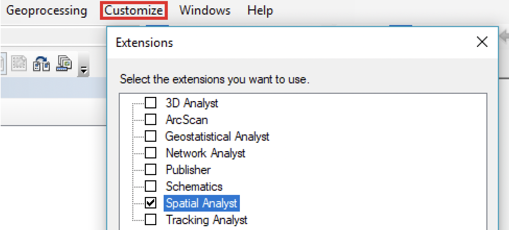
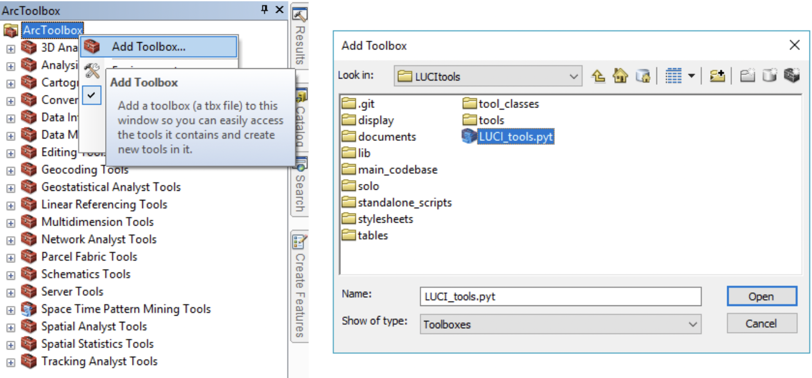
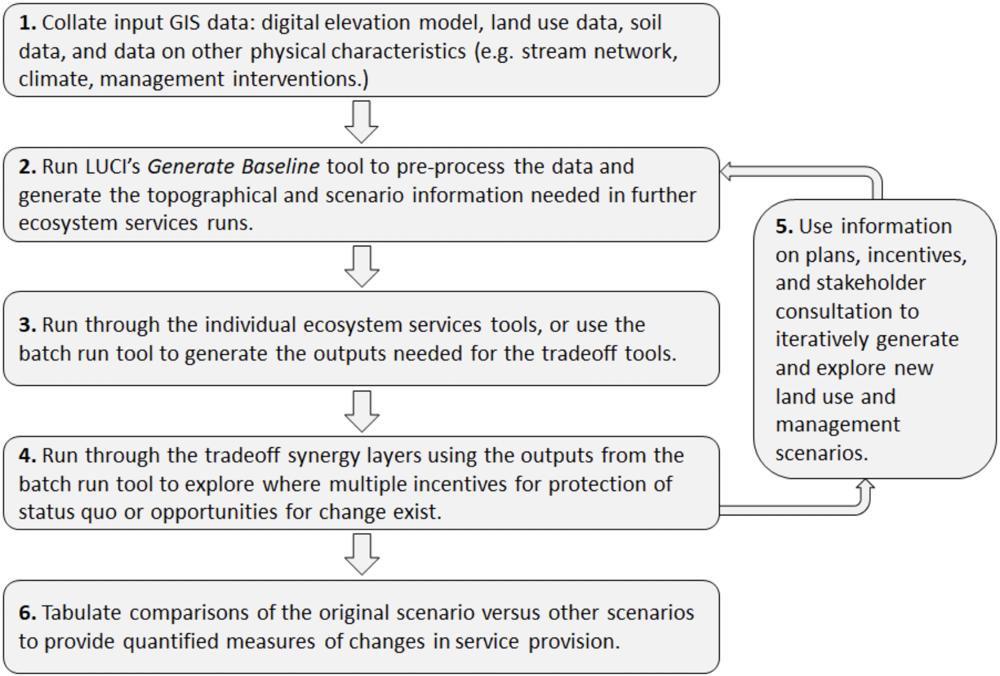

# Quick start guide

LUCI requires ArcGIS 10.4 or higher and the Spatial Analyst license to run. Generally any computer that is able to run ArcMap is able to run LUCI. ***Installing and using LUCI is done through GitHub, and instructions will be provided upon enquiry. Testing of server-based and web-based LUCI is currently ongoing.***

It is recommended to keep the LUCI files within their own folder on a drive where you have write permissions, and ensure that the folder structure is intact. The files must not be placed on in a OneDrive folder and the path to the files must not have any spaces. LUCI is likely to run much slower if it is put on a network drive, or is writing output to a network drive. We suggest using a local drive on your computer (e.g. the C drive). There are also significant speed increases when writing to solid state drives and to machines with ample memory.

## Setting up LUCI on ArcMap

1. **Ensure geoprocessing results are set so they can be overwritten:** Go to *Geoprocessing > Geoprocessing
Options....* Check "Overwrite the outputs of geoprocessing operations".
    
2. **Ensure spatial analyst license is enabled:** Go to *Customize > Extensions....* Check "Spatial Analyst."
    
3. **Load LUCI for use within ArcMap:** Through the ArcToolbox window, right-click on *ArcToolbox* and select *Add Toolbox....* Navigate to where you have stored the LUCI files and under the *LUCItools folder*, select the *LUCI_tools.pyt* file and click *Open*. A toolbox called *LUCI General Release Tools v0_8* will be added to your ArcToolbox window. If you would like LUCI to be automatically loaded into all future sections, right-click on *ArcToolbox* again once LUCI has loaded in, select *Save Settings* and *To Default*. If you do not do this, each time you use LUCI you will need to load the toolbox to your ArcMap session first.
    

LUCI is now ready to run. Here are a few technical guideliness for running LUCI:
- Please note there are a number of ArcGIS bugs that intermittently interrupt LUCI operations that are beyond our control: please exit ArcMap and start again if you have any error messages that do not give any guidance on what might have gone wrong, or relate to not being able to write or overwrite a file to a location.
- At the end of almost every tool is the **Rerun** parameter, which will continue the previous run from the point where any errors occurred.
- If restarting a second or third time does not fix the problem, please detail the error message to info@lucitools.org including a screenshot of the error and the data used if possible.
- The most common issues are caused by ArcGIS either switching its default location for writing intermediate files to a system directory without write permission part way through calculations, or failing to release a "hold" on files so that they cannot be overwritten, or become corrupted and cannot be properly deleted.
- If you are running ArcGIS using a network license, you also risk crashes or "hanging" if your network is not always working or there are problems with your network license. ArcGIS checks this license regularly and will stop geoprocessing anytime it cannot verify the license.
- You should also regularly clean out your default geodatabase which holds temporary ArcMap calculations, using ArcCatalog. Within ArcMap, this can be found by clicking *File > Map Document Properties...* and looking at the location in the resulting dialogue box. This should be pointing to a local drive if at all possible.

## Order of tools to run

Some of the LUCI operations require tools and algorithms to be carried out in a particular order, as defined below:

1. **Preprocessing:** First, use the *Generate Baseline* tool to generate the hydrological, climate, land use, and soil information LUCI requires to run the other tools. The resulting files define the topography and routing pathways for water, sediment, nutrients, etc. along with various site-specific parameters. This needs to be rerun each time a new land management scenario is being considered. This first step is the most computationally intensive, and should be carried out before field engagement.
2. **Run ecosystem services:** Any of the tools under *Individual Ecosystem Services* can now be run in any order. Alternatively, the *Batch run ecosystem services* tool can be run to generate the outputs for multiple services. The output from the batch run tool is also used as input to the tradeoffs tool.
3. **Identify tradeoffs:** Use the *Tradeoff maps* tool to generate maps that identify tradeoffs or synergies.
4. **View outputs:** All tools produce a PDF with the main output maps and summary tables produced by the tool. This PDF is found under the output folder with the same name as the tool. At the end of almost every tool is the **Generate PNG maps and graphs** option. When ticked, the tool will produce maps and graphs of the output that can be found under the *Images* folder inside the output folder

(Figure 1: Sample workflow for LUCI applications)

## Exploring different scenarios

There are two options for running land cover or management change scenarios through LUCI. Ensure that the land cover classiffcation of the new or amended land cover is aligned with the original land cover file used to generate the first scenario. For example, if the original land cover has a field called "CLASS_2012," then the new land cover must also have this field and the corresponding land cover values in the attribute table.

1. **Using new land cover information for the entire study area:** For large-scale changes or future land use management plans, the new land cover shapefiles can be used as input to the *Generate Baseline* tool as long as they have full coverage for the application region.
2. **Using new land cover information that partially covers the study area:** If only small areas within the study area are being changed, a shapefile containing partial coverage can be used as input. Within the *Generate Baseline* tool and under *7 More land cover parameters*, input this shapefile into the *Detailed or corrected land cover (optional)* parameter. This overwrites the original land cover and reruns the scenario generation.